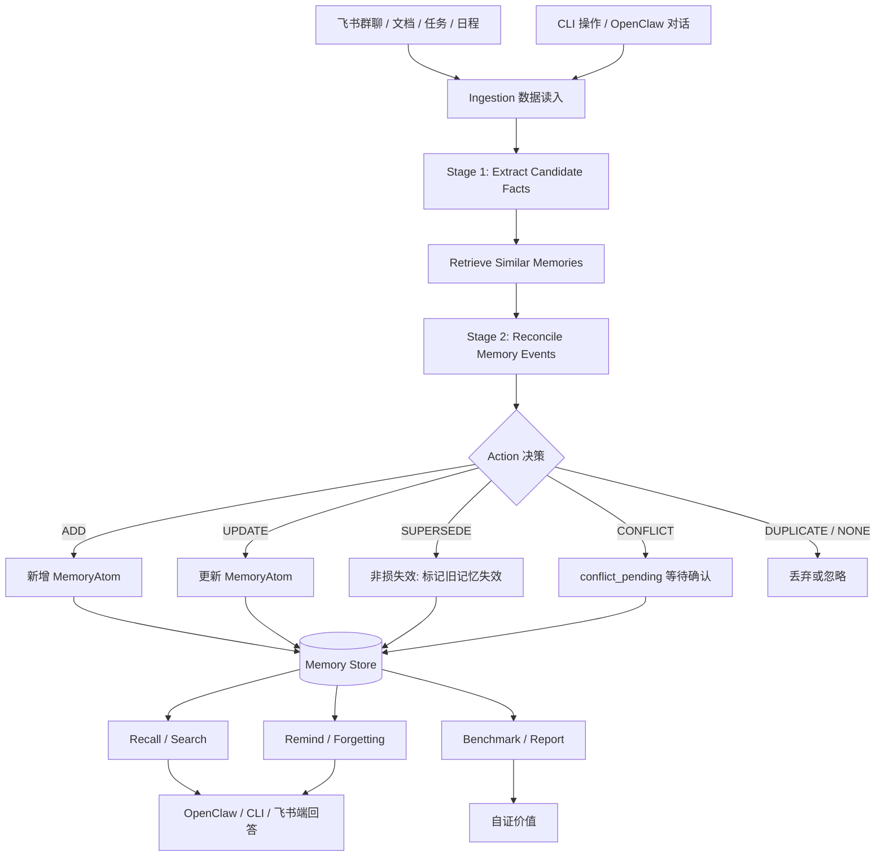

# Kairos


> 面向飞书与 OpenClaw 的企业级长程协作记忆引擎。

> **Kairos** 是项目对外名称，寓意“关键时刻 / 恰当时机”。它强调企业记忆不只是被动存储，而是在正确的时间召回正确的上下文。`memoryops` 仅作为 Kairos 的 CLI 命令名保留。

Kairos 是一个针对飞书 AI 校园挑战赛 OpenClaw Memory 赛道设计的企业协作记忆系统。它的目标不是做一个简单的聊天记录搜索工具，也不是泛泛的飞书 AI 助手，而是把飞书协作流中的碎片化信息沉淀为可管理、可检索、可更新、可遗忘、可评测的企业长期记忆。

## 背景问题

AI Agent 在企业协作中经常“失忆”：

- 忘记项目之前为什么选择方案 B，而不是方案 A；
- 忘记团队已经约定过的周报、审批、发布流程；
- 忘记某个风险事项几天前已经被提醒过；
- 无法区分旧规则和新规则，容易把过期信息当成当前事实；
- 只能搜索原始聊天记录，不能理解“这条信息是否还有效”。

单纯增加上下文长度或把聊天记录全部向量化，并不能解决这些问题。Kairos 试图把“记忆”设计成一种有生命周期、有证据链、有状态、有冲突处理能力、有评测指标的工程资产。

## 一句话定位

> Kairos 将飞书群聊、文档、任务、日程和 CLI 操作中的协作信息，转化为结构化的 MemoryAtom，并通过冲突更新、遗忘提醒和 Benchmark 证明长期记忆的实际价值。

## Quick Start（当前 WIP）

当前阶段已经可以运行 CLI 骨架、MemoryAtom Schema 校验和 smoke benchmark 数据集加载。

```bash
git clone git@github.com:CalWade/Kairos.git
cd Kairos
npm install

# 查看 CLI 命令
npm run dev -- --help

# 校验 MemoryAtom 示例是否符合 Zod Schema
npm run dev -- schema:check

# 加载 smoke benchmark 数据集
npm run dev -- eval --smoke

# 当前 add / recall 仍是 dry-run mock
npm run dev -- add --text "最终决定使用 PostgreSQL，不使用 MongoDB" --project kairos --type decision --subject database_selection
npm run dev -- search "PostgreSQL" --project kairos
npm run dev -- recall "我们为什么不用 MongoDB？" --project kairos --evidence

# 摄取文件并触发 mock 冲突覆盖
npm run dev -- ingest --file examples/weekly-report-conflict.md --project kairos
npm run dev -- search "周报" --project kairos --include-history

# 验证飞书会话导出文档标准化
npm run dev -- normalize-chat-export --file /tmp/feishu-chat-export.md --doc-token <doc_token>
npm run dev -- segment-chat-export --file /tmp/feishu-chat-export.md --doc-token <doc_token>
```

> 注意：当前 `add / search / recall / list / history` 已接入本地 SQLite Store 与 JSONL Event Log；LLM 两阶段抽取仍在开发中。

## 核心设计



## 关键能力

### 1. MemoryAtom 结构化记忆

Kairos 不直接存一段聊天文本，而是抽取结构化记忆单元：

- 记忆类型：决策、约定、偏好、工作流、风险、人员角色、截止日期、CLI 命令、知识；
- 作用域：个人、团队、组织、项目；
- 证据链：来源消息、文档、片段、时间；
- 多时间戳：系统创建时间、观察时间、现实生效时间、失效时间、系统过期时间；
- 状态：active、superseded、expired、deleted、conflict_pending；
- 冲突关系：supersedes / superseded_by；
- 遗忘策略：ebbinghaus、linear、step、none。

### 2. 两阶段记忆写入

借鉴 Mem0 的思路，Kairos 将 LLM 写入过程拆成两步：

```text
Extract：只从飞书消息 / 文档中抽取候选事实
Reconcile：结合相似旧记忆，判断 ADD / UPDATE / SUPERSEDE / DUPLICATE / CONFLICT / NONE
```

LLM 不直接改数据库，只输出结构化决策；最终写入由程序执行，降低不可控性。

### 3. 非损失效冲突更新

借鉴 Graphiti 的双时态思想，MemoryOps 在新旧记忆冲突时不硬删除旧记忆，而是通过 `invalid_at`、`expired_at`、`superseded_by` 保留历史。

例如：

```text
旧记忆：周报发给 Alice
新记忆：不对，周报以后发给 Bob
```

系统应返回当前有效规则：Bob，同时保留 Alice 作为历史版本。

### 4. 遗忘与复习提醒

Kairos 支持可配置的遗忘策略，并通过 fast-forward 模拟时间进行评测。

例如高风险事项：

```text
生产环境 API Key 已更新，新 key 只允许服务端使用，不允许前端直连。
```

系统可以在指定时间触发复习提醒，降低团队知识断层风险。

### 5. Benchmark 自证价值

Kairos 不只做 demo，还会设计评测集证明系统有效：

- 抗干扰测试：大量无关聊天中召回关键决策；
- 矛盾更新测试：新旧规则冲突时返回当前有效记忆；
- 遗忘提醒测试：通过 fast-forward 验证提醒逻辑；
- 效能指标测试：比较使用前后的查询步数、耗时和重复沟通成本。

## 计划中的 CLI

说明：`memoryops` 是 Kairos 的 CLI 命令名，保留自项目早期。

```bash
# 用户友好命令
memoryops add --text "最终决定使用 PostgreSQL，不使用 MongoDB"
memoryops search "数据库方案"
memoryops recall "我们为什么不用 MongoDB？" --evidence
memoryops history <atom_id>
memoryops remind --now 2026-05-30
memoryops eval --smoke
memoryops schema:check

# Agent-friendly 命令
memoryops atom.add
memoryops atom.search
memoryops atom.update
memoryops atom.forget
memoryops sync.feishu
```

## Demo 场景

### Demo 1：历史决策召回

输入一段飞书项目群讨论，系统自动提取“数据库选择 PostgreSQL，而不是 MongoDB”的决策记忆。之后用户询问“我们为什么不用 MongoDB？”，系统返回带证据链的历史决策。

### Demo 2：矛盾更新

系统先记住“周报发给 Alice”，随后收到“周报以后改发给 Bob”。再次查询时，系统返回 Bob，并把 Alice 标记为历史失效版本。

### Demo 3：团队遗忘预警

系统识别高风险事项，例如 API Key 更新、安全边界、上线窗口等，并根据遗忘策略在合适时间提醒团队复习。

## 目录结构

```text
memoryops/
  src/
    cli.ts
  docs/
    whitepaper.md
    benchmark-report.md
    demo-script.md
  skills/
    memoryops/
      SKILL.md
  examples/
  eval/
    datasets/
  runs/
  data/
```

## 当前进度

- [x] Candidate Segment Pipeline 第一步：Message Normalization 标准消息结构
- [x] Candidate Segment Pipeline 第二步：Conversation Segmentation 对话切分
- [x] Candidate Segment Pipeline 第三步：Salience Scoring + Adjacent Segment Merge
- [x] Candidate Segment Pipeline 第四步：Context Windowing + Denoising

- [x] 项目方向确定
- [x] GitHub 仓库初始化
- [x] README 初稿
- [x] 白皮书目录初稿
- [x] OpenClaw Skill 草案
- [x] CLI skeleton
- [x] MemoryAtom schema 实现
- [x] SQLite Store + JSONL Event Log
- [x] mock Extract / Reconcile 骨架
- [x] 飞书会话导出文档标准化 POC
- [x] 冲突更新
- [ ] fast-forward 遗忘提醒
- [x] smoke benchmark 数据集草案
- [ ] Demo 录屏

## 设计参考

Kairos 会借鉴但不复刻以下系统：

- Mem0：两阶段记忆写入与 action/event 决策；
- Graphiti：多时间戳、双时态、非损失效更新；
- Letta：分层记忆与工具化 memory 操作；
- Zep：混合检索与长期记忆评测思路；
- LoCoMo / LongMemEval：长期交互记忆 Benchmark 思路。

最终目标是把这些成熟范式收敛到飞书企业协作场景，重点解决项目决策、团队约定、风险提醒和长期上下文遗忘问题。
